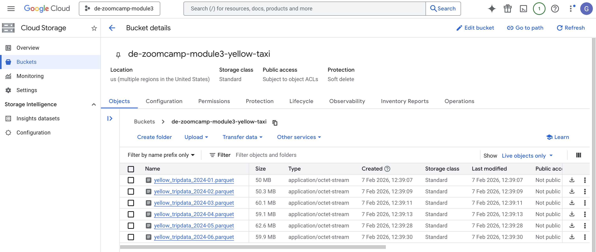
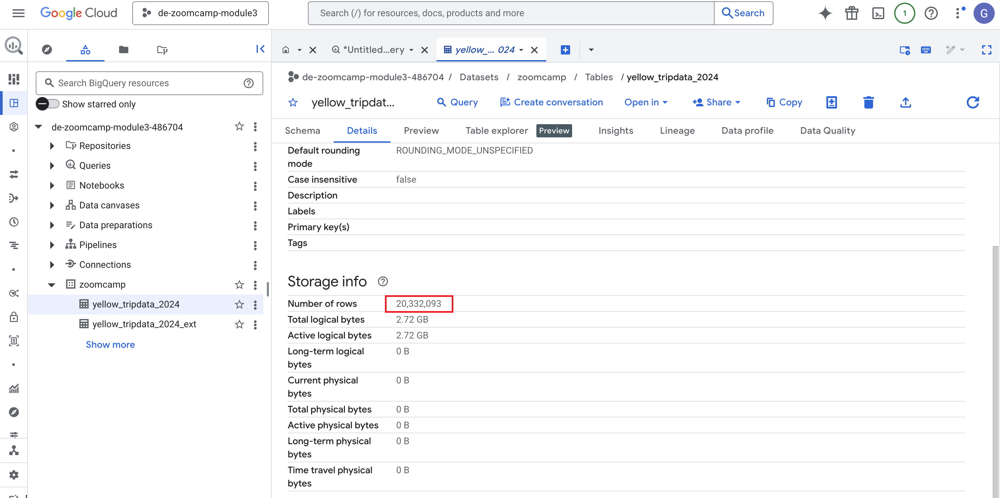
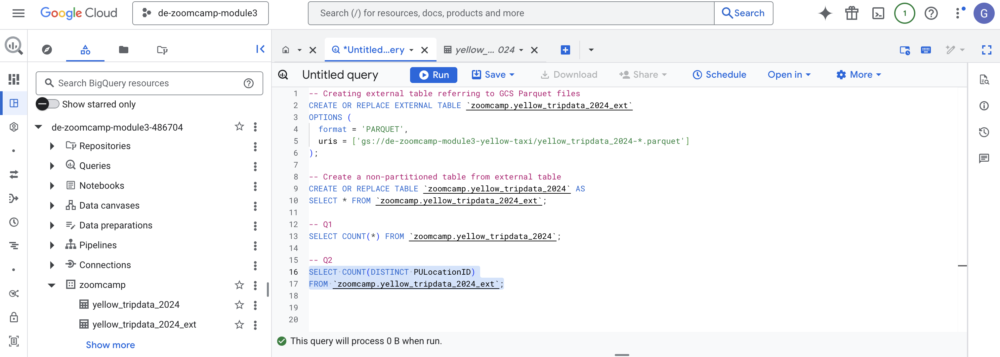
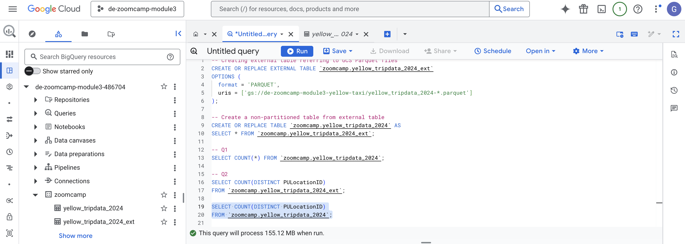
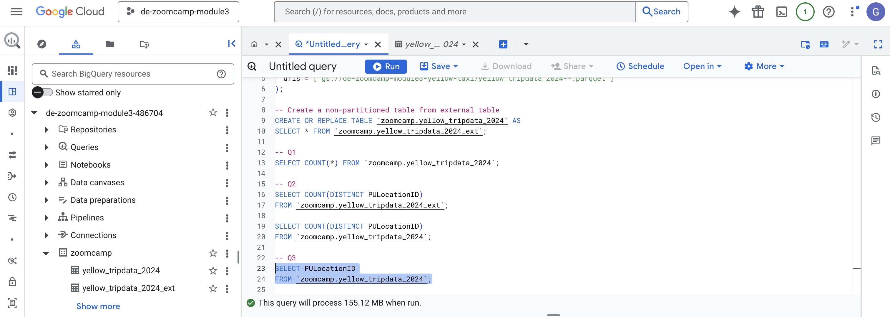
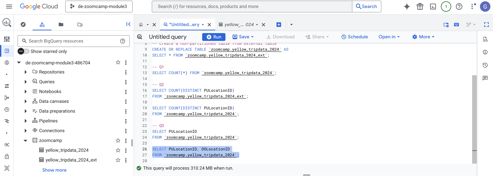
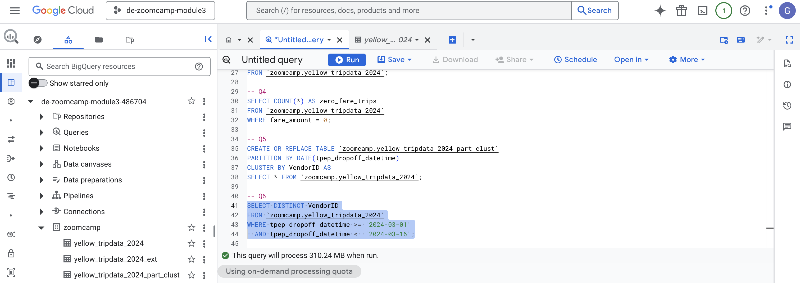
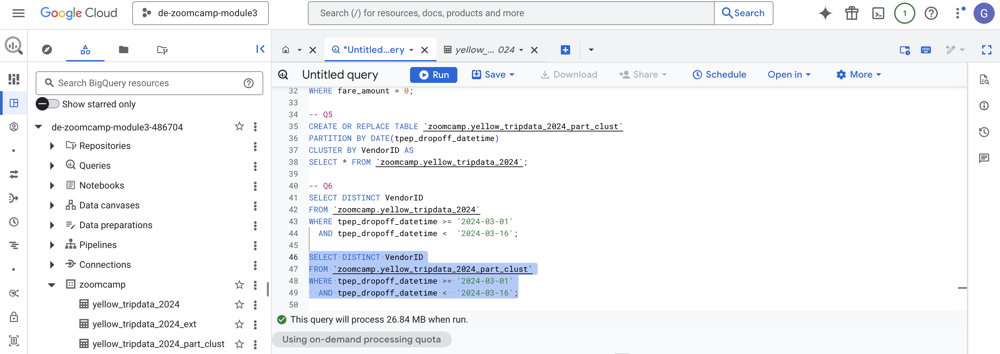
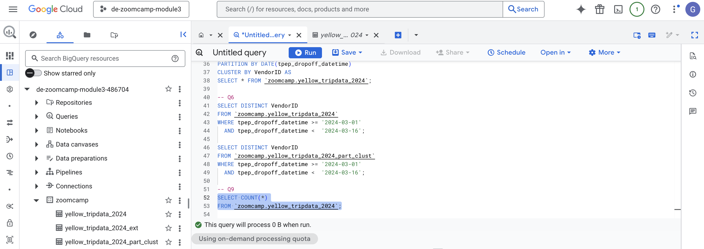

# Module 3 Homework: Data Warehousing & BigQuery

## Data

In this homework, I worked with NYC Yellow Taxi Trip Records from January 2024 to June 2024.

The data is provided as **Parquet files** by NYC TLC and is available at:  
https://www.nyc.gov/site/tlc/about/tlc-trip-record-data.page

Only the first six months of 2024 were used for this assignment.

## Loading the data to GCS

To load the data into Google Cloud Storage, I used the provided Python script: `load_yellow_taxi_data.py`

This script performs the following steps:
- Downloads the Parquet files for January–June 2024
- Creates a GCS bucket if it does not already exist
- Uploads all six Parquet files to the bucket

Authentication is handled using a **Google Cloud Service Account**, and the bucket name is configured directly in the script.

After running the script, I verified that all six Parquet files were successfully uploaded to the GCS bucket before proceeding.



## BigQuery Setup

### External Table

First, I created an **external table** in BigQuery that references the Parquet files stored in GCS.

This table allows querying the raw data directly without copying it into BigQuery storage.

```sql
CREATE OR REPLACE EXTERNAL TABLE `zoomcamp.yellow_tripdata_2024_ext`
OPTIONS (
  format = 'PARQUET',
  uris = ['gs://de-zoomcamp-module3-yellow-taxi/yellow_tripdata_2024-*.parquet']
);
```
This external table is later used as the source to create a regular BigQuery table.

### Materialized (Regular) Table

Next, I created a regular (materialized) BigQuery table from the external table.

This table stores the data inside BigQuery and is not partitioned or clustered, as required by the assignment.
```sql
CREATE OR REPLACE TABLE `zoomcamp.yellow_tripdata_2024` AS
SELECT * FROM `zoomcamp.yellow_tripdata_2024_ext`;
```

## Question 1. Counting records

What is count of records for the 2024 Yellow Taxi Data?
- 65,623
- 840,402
- 20,332,093 ✅
- 85,431,289

**Solution**

The total number of records can be verified directly from the BigQuery table details.

The screenshot below shows the **Number of rows** for the table `yellow_tripdata_2024`:



Alternatively, the same result can be obtained using the following SQL query:

```sql
SELECT COUNT(*) FROM `zoomcamp.yellow_tripdata_2024`;
```

## Question 2. Data read estimation

Write a query to count the distinct number of PULocationIDs for the entire dataset on both the tables.
 
What is the **estimated amount** of data that will be read when this query is executed on the External Table and the Table?

- 18.82 MB for the External Table and 47.60 MB for the Materialized Table
- 0 MB for the External Table and 155.12 MB for the Materialized Table ✅
- 2.14 GB for the External Table and 0MB for the Materialized Table
- 0 MB for the External Table and 0MB for the Materialized Table

**Solution**

**External Table**

```sql
SELECT COUNT(DISTINCT PULocationID)
FROM `zoomcamp.yellow_tripdata_2024_ext`;
```
For the external table, BigQuery can leverage Parquet metadata and query planning optimizations to compute the result without scanning the underlying data files. As a result, the estimated bytes processed is 0 MB.


**Materialized Table**

```sql
SELECT COUNT(DISTINCT PULocationID)
FROM `zoomcamp.yellow_tripdata_2024`;
```
For the materialized table, the data is stored inside BigQuery.
To compute the distinct count, BigQuery needs to scan the PULocationID column, which leads to an estimated 155.12 MB of data processed.


## Question 3. Understanding columnar storage

Write a query to retrieve the PULocationID from the table (not the external table) in BigQuery. Now write a query to retrieve the PULocationID and DOLocationID on the same table.

Why are the estimated number of Bytes different?
- BigQuery is a columnar database, and it only scans the specific columns requested in the query. Querying two columns (PULocationID, DOLocationID) requires  ✅
reading more data than querying one column (PULocationID), leading to a higher estimated number of bytes processed.
- BigQuery duplicates data across multiple storage partitions, so selecting two columns instead of one requires scanning the table twice, 
doubling the estimated bytes processed.
- BigQuery automatically caches the first queried column, so adding a second column increases processing time but does not affect the estimated bytes scanned.
- When selecting multiple columns, BigQuery performs an implicit join operation between them, increasing the estimated bytes processed

**Solution**
```sql
SELECT PULocationID
FROM `zoomcamp.yellow_tripdata_2024`;
```
When selecting only PULocationID, BigQuery estimates 155.12 MB processed.



```sql
SELECT PULocationID, DOLocationID
FROM `zoomcamp.yellow_tripdata_2024`;
```

When selecting both PULocationID and DOLocationID, BigQuery estimates 310.24 MB processed.


**Explanation**

BigQuery uses columnar storage, meaning it only scans the columns explicitly referenced in the query.
Querying two columns requires scanning more column data than querying a single column, which results in a higher estimated number of bytes processed.

## Question 4. Counting zero fare trips

How many records have a fare_amount of 0?
- 128,210
- 546,578
- 20,188,016
- 8,333 ✅

**Solution**
```sql
SELECT COUNT(*) AS zero_fare_trips
FROM `zoomcamp.yellow_tripdata_2024`
WHERE fare_amount = 0;
```


## Question 5. Partitioning and clustering

What is the best strategy to make an optimized table in Big Query if your query will always filter based on tpep_dropoff_datetime and order the results by VendorID (Create a new table with this strategy)

- Partition by tpep_dropoff_datetime and Cluster on VendorID ✅
- Cluster on by tpep_dropoff_datetime and Cluster on VendorID
- Cluster on tpep_dropoff_datetime Partition by VendorID
- Partition by tpep_dropoff_datetime and Partition by VendorID

**Solution**

Since queries always filter on `tpep_dropoff_datetime`, partitioning by this column allows BigQuery to scan only the relevant date partitions.  
Additionally, clustering on `VendorID` optimizes queries that order or filter by vendor within each partition.
```sql
CREATE OR REPLACE TABLE `zoomcamp.yellow_tripdata_2024_part_clust`
PARTITION BY DATE(tpep_dropoff_datetime)
CLUSTER BY VendorID AS
SELECT * FROM `zoomcamp.yellow_tripdata_2024`;
```

## Question 6. Partition benefits

Write a query to retrieve the distinct VendorIDs between tpep_dropoff_datetime
2024-03-01 and 2024-03-15 (inclusive)

Use the materialized table you created earlier in your from clause and note the estimated bytes. Now change the table in the from clause to the partitioned table you created for question 5 and note the estimated bytes processed. What are these values? 

Choose the answer which most closely matches.
- 12.47 MB for non-partitioned table and 326.42 MB for the partitioned table
- 310.24 MB for non-partitioned table and 26.84 MB for the partitioned table ✅
- 5.87 MB for non-partitioned table and 0 MB for the partitioned table
- 310.31 MB for non-partitioned table and 285.64 MB for the partitioned table

**Solution**

**Non-partitioned table**
```sql
SELECT DISTINCT VendorID
FROM `zoomcamp.yellow_tripdata_2024`
WHERE tpep_dropoff_datetime >= '2024-03-01'
  AND tpep_dropoff_datetime <  '2024-03-16';
```
This query scans the entire table because it is not partitioned, even though a date filter is applied. As a result, BigQuery estimates 310.24 MB of data processed.


**Partitioned & clustered table**
```sql
SELECT DISTINCT VendorID
FROM `zoomcamp.yellow_tripdata_2024_part_clust`
WHERE tpep_dropoff_datetime >= '2024-03-01'
  AND tpep_dropoff_datetime <  '2024-03-16';
```
This table is partitioned by tpep_dropoff_datetime, so BigQuery only scans the partitions that fall within the specified date range. As a result, the estimated data processed is reduced to 26.84 MB.


## Question 7. External table storage

Where is the data stored in the External Table you created?

- Big Query
- Container Registry
- GCP Bucket ✅
- Big Table 

**Solution**
In BigQuery, an external table does not store data inside BigQuery storage Instead, it references data that remains in an external source.

In this case, the external table points directly to Parquet files stored in a Google Cloud Storage (GCS) bucket, and BigQuery reads the data from GCS at query time.

## Question 8. Clustering best practices

It is best practice in Big Query to always cluster your data:
- True
- False ✅

**Solution**
Clustering is not always beneficial and should be applied based on query patterns and data size.

For small tables or workloads that do not frequently filter or aggregate on specific columns, clustering may provide little to no performance improvement and can add unnecessary complexity.

## Question 9. Understanding table scans

No Points: Write a `SELECT count(*)` query FROM the materialized table you created. How many bytes does it estimate will be read? Why?

**Solution**

```sql
SELECT COUNT(*)
FROM `zoomcamp.yellow_tripdata_2024`;
```

BigQuery estimates 0 bytes processed for this query.

Although COUNT(*) computes a result over the entire table, BigQuery does not need to scan the underlying column data.
Instead, it can retrieve the total number of rows directly from the table’s metadata.

In contrast, queries that involve:
- DISTINCT
- filtering conditions (WHERE)
- or selecting specific columns

require BigQuery to scan the relevant column data, which results in non-zero bytes processed.


