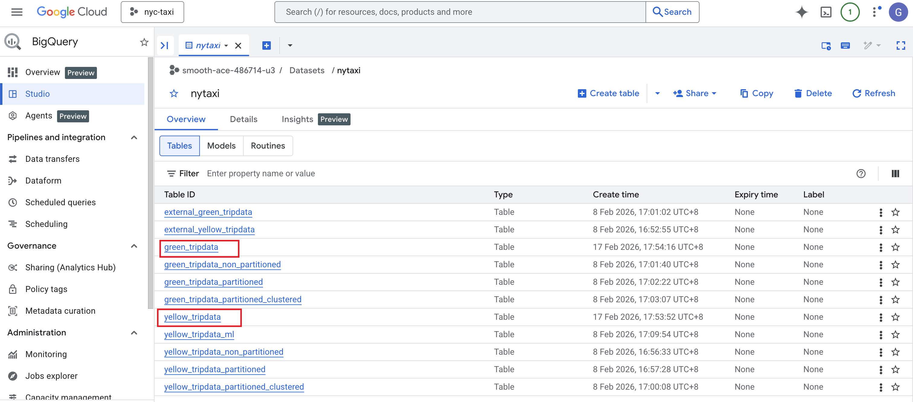
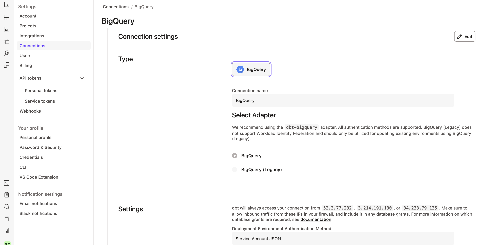
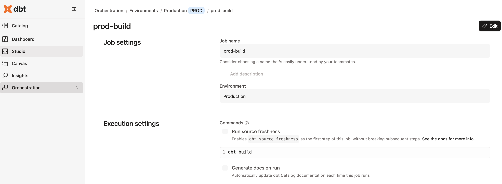
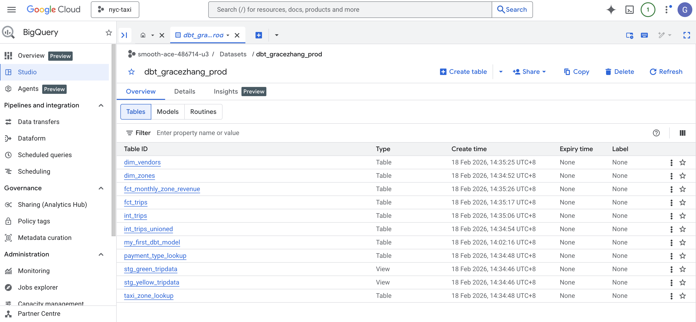
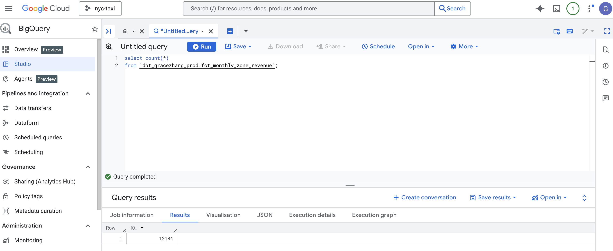
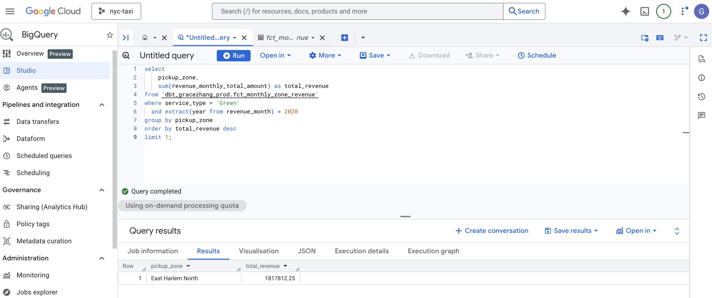
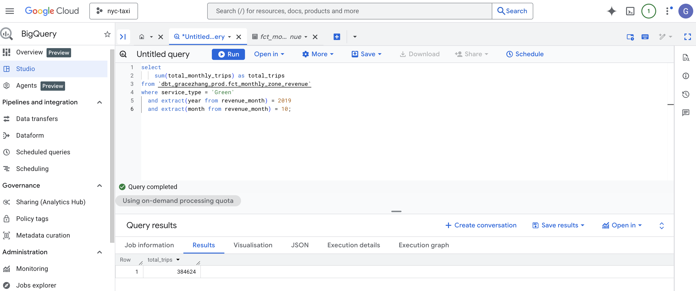
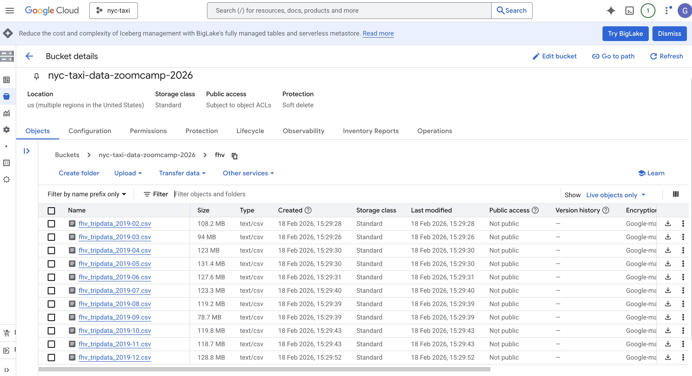
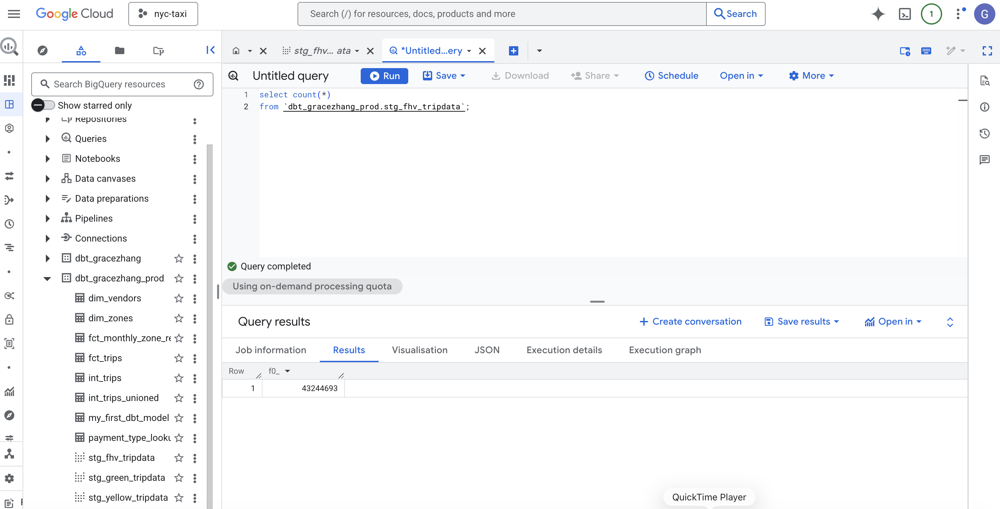

# Module 4 Homework: Analytics Engineering with dbt

This homework demonstrates how I used **dbt Cloud + BigQuery** to transform raw NYC taxi trip data into analytics-ready models.

The project follows a layered dbt structure:
- Staging models – clean and standardize raw Green and Yellow taxi data  
- Intermediate models – combine datasets and apply business logic  
- Marts (fact & dimension models) – build analytics-ready tables  
- Tests & documentation – ensure data quality and model integrity  

## Setup

This homework was completed using the Cloud setup: 
- BigQuery as the warehouse 
- dbt Cloud for development and runs

### 1) Project structure

The dbt project lives in this repository under:

- [taxi_rides_ny/](../taxi_rides_ny/) 

### 2) BigQuery prerequisites

Make sure the following are ready in GCP:

- BigQuery API enabled
- A dataset created for the course (e.g. nytaxi)
- Raw tables available in the dataset:
  - green_tripdata (2019–2020)
  - yellow_tripdata (2019–2020)

Screenshot for verifying the raw tables in BigQuery:


### 3) dbt Cloud connection (BigQuery)

In dbt Cloud, I created a BigQuery connection using a service account with permissions to:
- read from the raw dataset (e.g. nytaxi)
- create models in the dbt target dataset (e.g. dbt_<username>)

Screenshot for dbt Cloud connection setup:



### 4) Development vs Production environments

I configured two environments in dbt Cloud:
- **Development (DEV)** – used inside Studio for development and testing  
- **Production (PROD)** – used for deployment jobs and final homework results  

The Production environment writes models to the BigQuery dataset:
dbt_<username>_prod

In my case:
dbt_gracezhang_prod

### 5) Deployment Job (Production build)

Instead of running dbt manually with `--target prod`, I configured a **dbt Cloud deployment job**:

- Environment: Production  
- Branch: `main`  
- Command: `dbt build`  

The deployment job:
1. Pulls the latest code from the `main` branch
2. Builds all models
3. Runs tests
4. Materializes tables into the production dataset in BigQuery

Screenshot of the production job configuration:



### 6) Successful production build

After merging my changes to `main`, I triggered the Production job.
All models were successfully materialized into:
dbt_gracezhang_prod

Screenshot showing the production dataset in BigQuery:



## Questions

### Question 1. dbt Lineage and Execution

Given a dbt project with the following structure:

```
models/
├── staging/
│   ├── stg_green_tripdata.sql
│   └── stg_yellow_tripdata.sql
└── intermediate/
    └── int_trips_unioned.sql (depends on stg_green_tripdata & stg_yellow_tripdata)
```

If you run `dbt run --select int_trips_unioned`, what models will be built?

- `stg_green_tripdata`, `stg_yellow_tripdata`, and `int_trips_unioned` (upstream dependencies)
- Any model with upstream and downstream dependencies to `int_trips_unioned`
- `int_trips_unioned` only ✅
- `int_trips_unioned`, `int_trips`, and `fct_trips` (downstream dependencies)

**Solution**

When running `dbt run --select int_trips_unioned`, dbt builds only the model explicitly selected.

By default, `--select` does not automatically include upstream or downstream dependencies. It targets exactly the node specified.

Even though `int_trips_unioned` depends on:
- `stg_green_tripdata`
- `stg_yellow_tripdata`

those models will not be rebuilt automatically. dbt assumes they already exist in the warehouse.

To include upstream dependencies, graph operators must be used:

`dbt run --select +int_trips_unioned`

- `+model` → includes upstream dependencies  
- `model+` → includes downstream dependencies  
- `+model+` → includes both upstream and downstream  

Key concept:  
`--select model_name` builds only that model unless graph operators are added.

### Question 2. dbt Tests

You've configured a generic test like this in your `schema.yml`:

```yaml
columns:
  - name: payment_type
    data_tests:
      - accepted_values:
          arguments:
            values: [1, 2, 3, 4, 5]
            quote: false
```

Your model `fct_trips` has been running successfully for months. A new value `6` now appears in the source data.

What happens when you run `dbt test --select fct_trips`?

- dbt will skip the test because the model didn't change
- dbt will fail the test, returning a non-zero exit code ✅
- dbt will pass the test with a warning about the new value
- dbt will update the configuration to include the new value

**Solution**

The accepted_values test enforces that payment_type must only contain: 
[1, 2, 3, 4, 5]. 

If a new value 6 appears in the data, the test query will return rows where payment_type = 6.

In dbt:
- If a test returns any rows → it fails
-	A failed test produces a non-zero exit code

dbt does not automatically update the configuration or ignore new values. Tests validate the current data in the warehouse, not whether the model SQL changed.

### Question 3. Counting Records in `fct_monthly_zone_revenue`

After running your dbt project, query the `fct_monthly_zone_revenue` model.

What is the count of records in the `fct_monthly_zone_revenue` model?

- 12,998
- 14,120
- 12,184 ✅
- 15,421

**Solution**
To answer this question, run:
```sql
select count(*)
from `dbt_gracezhang_prod.fct_monthly_zone_revenue`;
```

Screenshot of the query result in BigQuery:


Each row represents aggregated monthly metrics at the level of:
- service_type
- pickup_zone
- revenue_month

### Question 4. Best Performing Zone for Green Taxis (2020)

Using the `fct_monthly_zone_revenue` table, find the pickup zone with the **highest total revenue** (`revenue_monthly_total_amount`) for **Green** taxi trips in 2020.

Which zone had the highest revenue?

- East Harlem North ✅
- Morningside Heights
- East Harlem South
- Washington Heights South

**Solution**
To answer this question, aggregate total revenue for Green taxis in 2020 and sort in descending order:
```sql
select
    pickup_zone,
    sum(revenue_monthly_total_amount) as total_revenue
from `dbt_gracezhang_prod.fct_monthly_zone_revenue`
where service_type = 'Green'
  and extract(year from revenue_month) = 2020
group by pickup_zone
order by total_revenue desc
limit 1;
```
Screenshot of the query result in BigQuery:


The result shows that East Harlem North generated the highest total revenue for Green taxi trips in 2020.

### Question 5. Green Taxi Trip Counts (October 2019)

Using the `fct_monthly_zone_revenue` table, what is the **total number of trips** (`total_monthly_trips`) for Green taxis in October 2019?

- 500,234
- 350,891
- 384,624 ✅
- 421,509


**Solution**

To answer this question, sum the total monthly trips for Green taxis in October 2019:
```sql
select
    sum(total_monthly_trips) as total_trips
from `dbt_gracezhang_prod.fct_monthly_zone_revenue`
where service_type = 'Green'
  and extract(year from revenue_month) = 2019
  and extract(month from revenue_month) = 10;
```
Screenshot of the query result in BigQuery:


### Question 6. Build a Staging Model for FHV Data

Create a staging model for the **For-Hire Vehicle (FHV)** trip data for 2019.

1. Load the [FHV trip data for 2019](https://github.com/DataTalksClub/nyc-tlc-data/releases/tag/fhv) into your data warehouse
2. Create a staging model `stg_fhv_tripdata` with these requirements:
   - Filter out records where `dispatching_base_num IS NULL`
   - Rename fields to match your project's naming conventions (e.g., `PUlocationID` → `pickup_location_id`)

What is the count of records in `stg_fhv_tripdata`?

- 42,084,899
- 43,244,693 ✅
- 22,998,722 
- 44,112,187


**Solution**

### Step 1 – Load FHV 2019 data into GCS

The raw FHV 2019 data was downloaded from: https://github.com/DataTalksClub/nyc-tlc-data/releases/tag/fhv

A Python script was used to:
- Download .csv.gz files for each month of 2019
- Decompress them
- Upload the .csv files to a GCS bucket

The upload script is available here:
[scripts/load_fhv_2019_to_gcs.py](../scripts/load_fhv_2019_to_gcs.py)

Example GCS path:
```
gs://nyc-taxi-data-zoomcamp-2026/fhv/fhv_tripdata_2019-01.csv
```

Screenshot of the GCS bucket containing FHV 2019 files:


At this stage, the raw CSV files are stored in Cloud Storage and ready to be loaded into BigQuery.

### Step 2 – Load FHV data into BigQuery
#### 2.1 Create External Table
```sql
CREATE OR REPLACE EXTERNAL TABLE `nytaxi.fhv_tripdata_ext`
OPTIONS (
  format = 'CSV',
  uris = ['gs://nyc-taxi-data-zoomcamp-2026/fhv/*.csv'],
  skip_leading_rows = 1
);
```
This external table reads directly from GCS without loading data into BigQuery storage.

#### 2.2 Create Partitioned Native Table
```sql
CREATE OR REPLACE TABLE `nytaxi.fhv_tripdata`
PARTITION BY DATE(pickup_datetime)
AS
SELECT *
FROM `nytaxi.fhv_tripdata_ext`;
```

This step:
- Materializes the data into BigQuery
- Partitions by pickup_datetime
- Improves performance and reduces scan cost

The table nytaxi.fhv_tripdata is now ready to be referenced in dbt.

### Step 3 – Create stg_fhv_tripdata in dbt
#### 3.1 Define Source in sources.yml
This table is added under the existing raw source.

```yaml
- name: fhv_tripdata
  description: Raw FHV trip records (2019)
  loaded_at_field: pickup_datetime
  columns:
    - name: dispatching_base_num
      description: Dispatching base number (nulls filtered in staging)
    - name: pickup_datetime
    - name: dropoff_datetime
    - name: pulocationid
    - name: dolocationid
```

#### 3.2 Create stg_fhv_tripdata.sql

```sql
with source as (

    select *
    from {{ source('raw', 'fhv_tripdata') }}

),

renamed as (

    select
        -- identifiers
        cast(dispatching_base_num as string) as dispatching_base_num,

        -- timestamps
        cast(pickup_datetime as timestamp) as pickup_datetime,
        cast(dropoff_datetime as timestamp) as dropoff_datetime,

        -- location ids
        cast(pulocationid as integer) as pickup_location_id,
        cast(dolocationid as integer) as dropoff_location_id,

        cast(sr_flag as integer) as sr_flag

    from source

    -- Homework requirement
    where dispatching_base_num is not null

)

select * from renamed


where pickup_datetime >= '2019-01-01'
  and pickup_datetime < '2019-02-01'

```
This staging model:
- Filters out dispatching_base_num IS NULL
- Renames fields to follow project conventions
- Applies deterministic sampling in dev

### Step 4 – Build in Production

After merging to `main`, the Production deployment job (`dbt build`) was triggered.

Then run:

```sql
select count(*)
from `dbt_gracezhang_prod.stg_fhv_tripdata`;
```

Screenshot of the query result:
