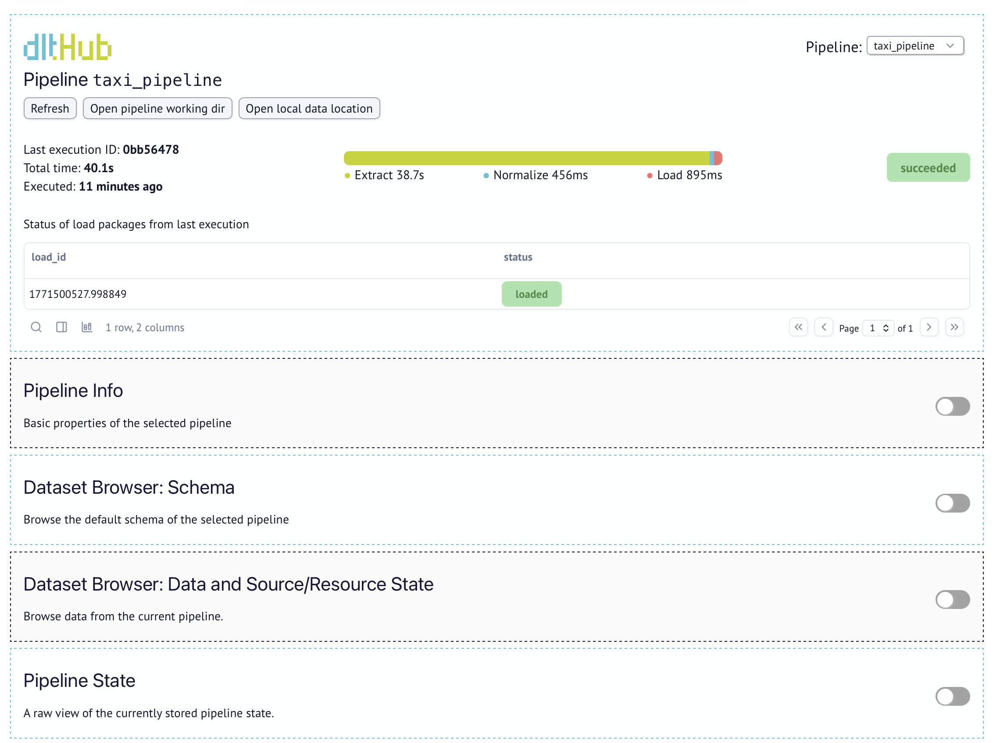
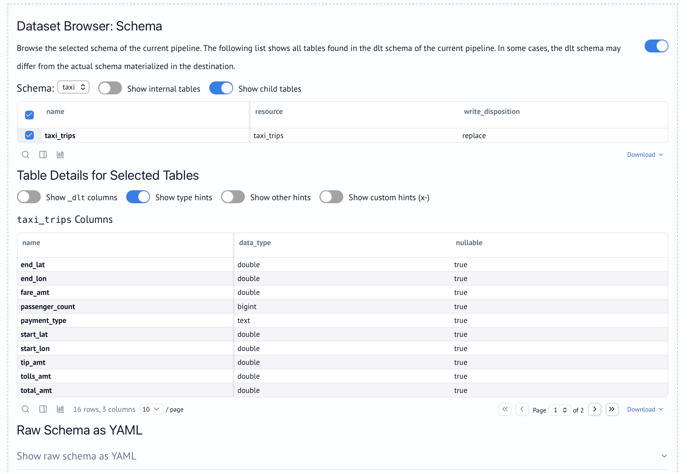
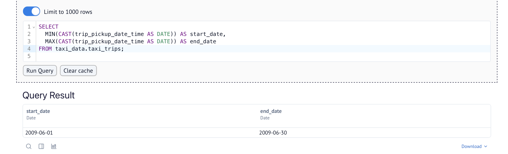
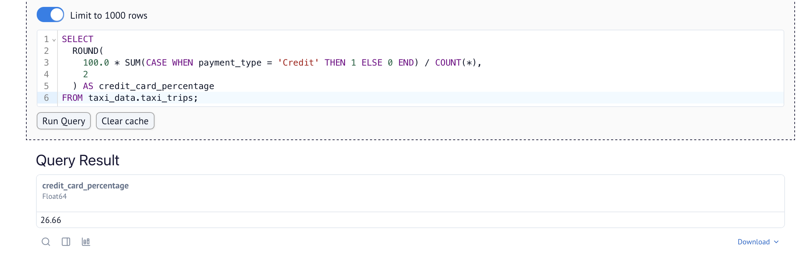
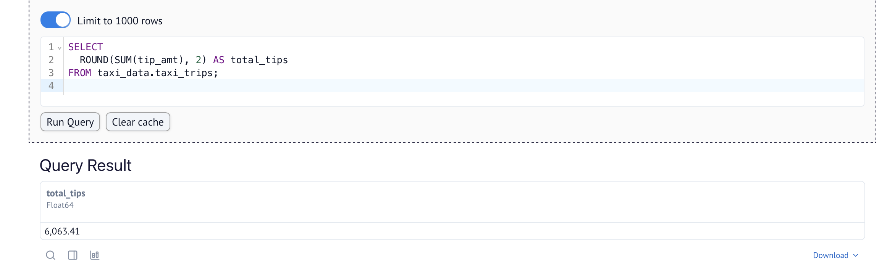

# Workshop Homework: dlt (data load tool)

Built a custom dlt pipeline to load NYC Yellow Taxi trip data from a paginated REST API into DuckDB.

Project location: [workshop-dlt/taxi-pipeline](../taxi-pipeline)

## Data Source

| Property | Value |
|----------|-------|
| Base URL | `https://us-central1-dlthub-analytics.cloudfunctions.net/data_engineering_zoomcamp_api` |
| Format | Paginated JSON |
| Page Size | 1,000 records per page |
| Pagination | Stop when an empty page is returned |

## Setup

### Step 1: Create Project

```bash
mkdir taxi-pipeline
cd taxi-pipeline
```

### Step 2: Set Up dlt MCP Server

Added the dlt MCP server in Cursor (Settings → Tools & MCP → New MCP Server):

```json
{
  "mcpServers": {
    "dlt": {
      "command": "uv",
      "args": [
        "run",
        "--with", "dlt[duckdb]",
        "--with", "dlt-mcp[search]",
        "python", "-m", "dlt_mcp"
      ]
    }
  }
}
```

### Step 3: Install dlt

```bash
pip install "dlt[workspace]"
```

### Step 4: Initialize Project

```bash
dlt init dlthub:taxi_pipeline duckdb
```

Since this API has no scaffold, no YAML metadata file was generated — API details were provided manually to the agent.

### Step 5: Prompt the Agent

Used Cursor agent to build the pipeline with the following prompt:

```
Build a REST API source for NYC taxi data.

API details:
- Base URL: https://us-central1-dlthub-analytics.cloudfunctions.net/data_engineering_zoomcamp_api
- Data format: Paginated JSON (1,000 records per page)
- Pagination: Stop when an empty page is returned

Place the code in taxi_pipeline.py and name the pipeline taxi_pipeline.
```

Result: [`taxi_pipeline.py`](../taxi-pipeline/taxi_pipeline.py)

| Config | Value |
|--------|-------|
| Pipeline name | `taxi_pipeline` |
| Destination | DuckDB (`taxi_pipeline.duckdb`) |
| Dataset | `taxi_data` |
| Write Disposition | `replace` |

### Step 6: Run the Pipeline

```bash
cd taxi-pipeline
uv run taxi_pipeline.py
```

Pipeline fetched 10 pages (10,000 records total) and loaded into `taxi_data.taxi_trips`.

## Exploring the Data

### dlt Dashboard

```bash
uv run dlt pipeline taxi_pipeline show
```





### Agent Questions (via dlt MCP Server)

Asked the dlt MCP agent the following questions about the pipeline:

**Q1: What tables were created in the taxi_pipeline?**

Schema: `taxi_data`

1. **taxi_trips** — Main table with 10,000 NYC taxi trip records
2. **_dlt_loads** — dlt system table for tracking loads
3. **_dlt_pipeline_state** — dlt system table for pipeline state
4. **_dlt_version** — dlt system table for schema versioning

**Q2: What columns exist in taxi_trips?**

| Column | Type |
|--------|------|
| end_lat | DOUBLE |
| end_lon | DOUBLE |
| fare_amt | DOUBLE |
| passenger_count | BIGINT |
| payment_type | VARCHAR |
| start_lat | DOUBLE |
| start_lon | DOUBLE |
| tip_amt | DOUBLE |
| tolls_amt | DOUBLE |
| total_amt | DOUBLE |
| trip_distance | DOUBLE |
| trip_dropoff_date_time | TIMESTAMP WITH TIME ZONE |
| trip_pickup_date_time | TIMESTAMP WITH TIME ZONE |
| surcharge | DOUBLE |
| vendor_name | VARCHAR |
| store_and_forward | DOUBLE |
| _dlt_load_id | VARCHAR |
| _dlt_id | VARCHAR |

Total: **18 columns** (16 data columns + 2 dlt system columns)

**Q3: How many total rows were loaded?**

**10,000 rows** — 10 pages × 1,000 records per page fetched from the API.

**Q4: What is the minimum and maximum Trip_Pickup_DateTime?**

- **Minimum:** 2009-06-01 19:33:00+08:00
- **Maximum:** 2009-07-01 07:58:00+08:00

The data covers a one-month period in June–July 2009.

**Q5: What percentage of trips were paid with credit card?**

- **Credit:** 26.66% (2,666 trips)
- CASH: 72.35% (7,235 trips)
- Cash: 0.97% (97 trips)
- Dispute: 0.01% (1 trip)
- No Charge: 0.01% (1 trip)

**Q6: What is the total sum of Tip_Amt?**

**$6,063.41**

## Questions

### Question 1: What is the start date and end date of the dataset?

- 2009-01-01 to 2009-01-31
- 2009-06-01 to 2009-07-01 ✅
- 2024-01-01 to 2024-02-01
- 2024-06-01 to 2024-07-01

```sql
SELECT
  MIN(CAST(trip_pickup_date_time AS DATE)) AS start_date,
  MAX(CAST(trip_pickup_date_time AS DATE)) AS end_date
FROM taxi_data.taxi_trips;
```



### Question 2: What proportion of trips are paid with credit card?

- 16.66%
- 26.66% ✅
- 36.66%
- 46.66%

```sql
SELECT
  ROUND(
    100.0 * SUM(CASE WHEN payment_type = 'Credit' THEN 1 ELSE 0 END) / COUNT(*),
    2
  ) AS credit_card_percentage
FROM taxi_data.taxi_trips;
```



### Question 3: What is the total amount of money generated in tips?

- $4,063.41
- $6,063.41 ✅
- $8,063.41
- $10,063.41

```sql
SELECT
  ROUND(SUM(tip_amt), 2) AS total_tips
FROM taxi_data.taxi_trips;
```


